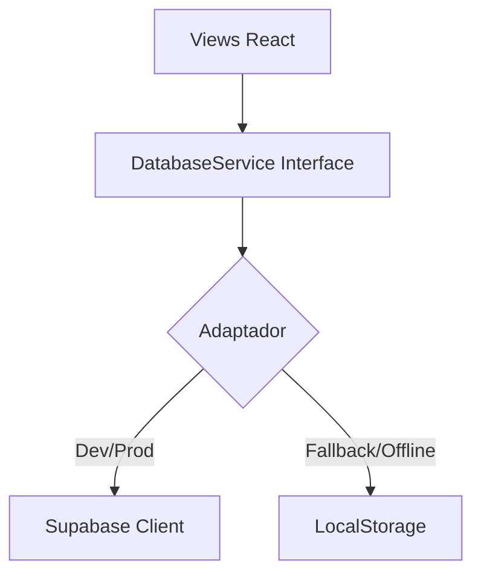

# Plano de Migração de Backend: Supabase (Local & Cloud)

Este documento detalha a estratégia para migrar a persistência de dados do `localStorage` (navegador) para o **Supabase** (PostgreSQL), permitindo um ambiente profissional de SaaS com sincronização de dados e segurança real.

## 1. Visão Geral
Atualmente, o PRD-Prompt.ai é uma aplicação *local-first* não persistente entre dispositivos. A migração para o Supabase trará:
- Banco de Dados Relacional (PostgreSQL).
- Autenticação Segura (Auth).
- Políticas de Segurança (RLS - Row Level Security).
- Desenvolvimento Local via Docker (Supabase CLI).

## 2. Arquitetura Proposta (Padrão Adapter)
Para minimizar impacto no código existente, manteremos a "assinatura" do `databaseService`, mas alteraremos sua implementação interna.

## 3. Estrutura do Banco de Dados (Schema)

Tabelas planejadas para substituir o JSON atual:

### `profiles` (Extensão da tabela `auth.users`)
- `id` (uuid, PK, ref `auth.users`)
- `email` (text)
- `name` (text)
- `avatar_url` (text)
- `role` (text: 'user' | 'admin') - *Aqui resolvemos a gestão de admin*

### `prds`
- `id` (uuid, PK)
- `user_id` (uuid, FK `profiles.id`)
- `title` (text)
- `content` (jsonb) - *Armazena todo o objeto complexo do PRD*
- `status` (text)
- `created_at` (timestamp)
- `updated_at` (timestamp)

### `prompts`
- `id` (uuid, PK)
- `user_id` (uuid, FK `profiles.id`)
- `prd_id` (uuid, FK `prds.id`, nullable)
- `content` (text)
- `meta` (jsonb) - *Tipo, plataforma, stack*
- `created_at` (timestamp)

## 4. Plano de Execução Passo a Passo

### Fase 1: Configuração do Ambiente Local (Supabase CLI)
- [ ] **1.1 Pré-requisitos**: Instalar Docker e Supabase CLI.
- [ ] **1.2 Inicialização**: Executar `supabase init` na raiz do projeto.
- [ ] **1.3 Start**: Rodar `supabase start` para subir o banco local.
- [ ] **1.4 Migrations**: Criar arquivo SQL inicial com as tabelas acima.
- [ ] **1.5 Tipagem**: Rodar comando para gerar tipos TypeScript do banco automaticamente (`supabase gen types`).

### Fase 2: Integração no Frontend
- [ ] **2.1 Instalação**: `npm install @supabase/supabase-js`.
- [ ] **2.2 Cliente**: Criar `services/supabaseClient.ts` lendo variáveis de ambiente (`VITE_SUPABASE_URL`, `VITE_SUPABASE_ANON_KEY`).
- [ ] **2.3 Auth Service**: Criar métodos de login/registro usando `supabase.auth`.

### Fase 3: Refatoração do `databaseService.ts`
Esta é a fase crítica. Vamos reescrever os métodos para apontar para o Supabase.

- [ ] **3.1 Auth**: Substituir lógica fake por `supabase.auth.signUp()`.
- [ ] **3.2 PRDs**:
    - `createPrd`: `supabase.from('prds').insert(...)`.
    - `getPrds`: `supabase.from('prds').select('*')`.
- [ ] **3.3 Admin**:
    - Middleware RLS: Criar Policies no banco ("Users can only see their own data").
    - Admin Policy: "Admins can see all data".

### Fase 4: Migração de Dados (Opcional)
- [ ] Criar script para pegar dados do `localStorage` do usuário e enviar para o Supabase no primeiro login.

## 5. Como Testar
1. Rodar `supabase start`.
2. Rodar `npm run dev`.
3. Criar conta (agora vai bater no Auth local do Supabase).
4. Verificar dados no Dashboard do Supabase Studio (http://localhost:54323).

